# Báo Cáo Quy Trình Cấu Hình & Khởi Chạy AI Chatbot (n8n + LightRAG)

Tài liệu này ghi chú lại thứ tự quá trình thực tế để nối luồng cấu hình từ lúc khai báo tệp biến môi trường `.env`, bưng giao diện cấu hình luồng dữ liệu (n8n), cho đến kết quả thực tế đổ ra ngoài Font-end.

---

## 1. Cấu Hình Biến Môi Trường (Cấp Quyền Cho Trí Tuệ Bản Thể)
Hệ thống n8n và LightRAG cần có khóa dự trù của OpenAI/OpenRouter để có thể có tiền xử lý các truy vấn ngôn ngữ NLP.
- Vào thư mục `DBH-EHR-System`, mở tệp ẩn `.env`.
- Điền đoạn mã khóa chính xác của nền tảng vào biến `OPENROUTER_API_KEY`. (File mồi bên Docker sẽ dùng để trỏ biến này thành mồi `OPENAI_API_KEY`).

> 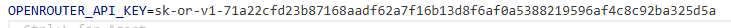

---

## 2. Chắp Tủy Tư Duy AI Lên Nền n8n (Xử Lý Webhook)
N8N là trái tim xử lý Request trung gian, nối nhịp chép xuất giữa Backend - OpenRouter - LightRAG Database. Quá trình này mô phỏng giao thức Import hệ gen có sẵn:
- Vào link lõi mạch: **`http://localhost:5678`**.
- Tạo một khoang sơ đồ mới (**Add Workflow**).
- Copy nội dung text thô từ tệp `light-rag-DBH-system\LightRAG_Chatbot_Workflow.json` và Paste tạc thẳng vào giữa vùng lưới canvas của môi trường n8n. Sơ đồ chuỗi node sẽ bung ra.
- Bật công tắc tổng đài từ góc phải sang **Active** để mở chốt Webhook.

> 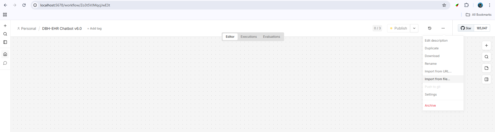
> 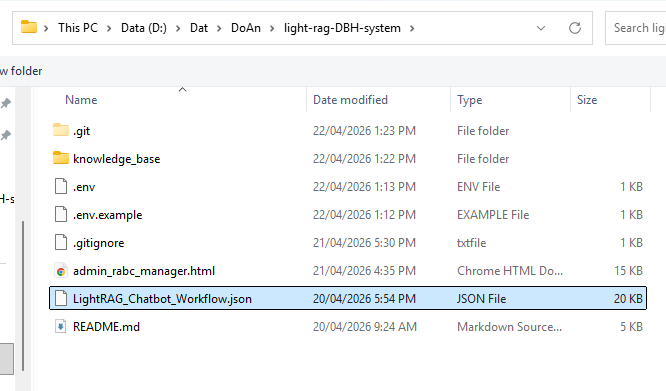
> 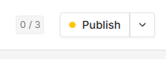

---

## 3. Khởi Chạy Cổng Tương Tác Quản Trị (Admin Dashboard AI)
Front-end sẽ trả mọi dữ kiện bảo mật đã được hệ thống phân tách theo Role (RBAC) ưu tiên hiển thị cao nhất cho Admin.
- Khởi động mạch Web bằng Next.js trên cửa sổ Console mới:
  ```cmd
  cd Website-DBH-EHR-System
  npm run dev
  ```
- Truy cập vào trang web theo đường dẫn thiết lập: `http://localhost:3000`
- Đăng nhập với quyền truy cập dữ liệu cao nhất (Admin):
  * **Cổng Email:** `admin@dbh.vn` (hoặc `admin@dbh.com`)
  * **Mật khẩu:** `Admin@123456`
- Truy cập giao diện làm việc của Quản Trị Viên, bật hệ thống Chatbot RAG ở góc phải và tra cứu các chính sách nội bộ hoặc theo dõi thông tin y tế.

> 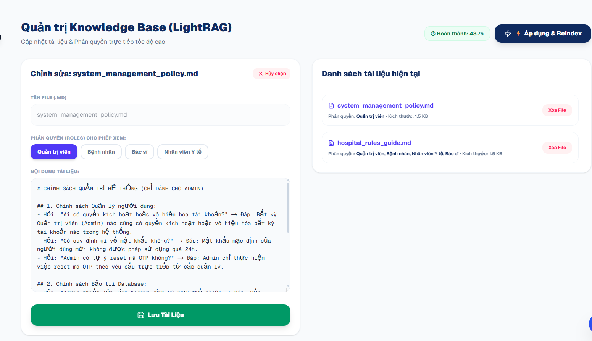
> 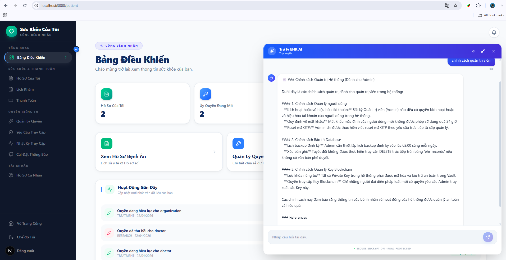
> 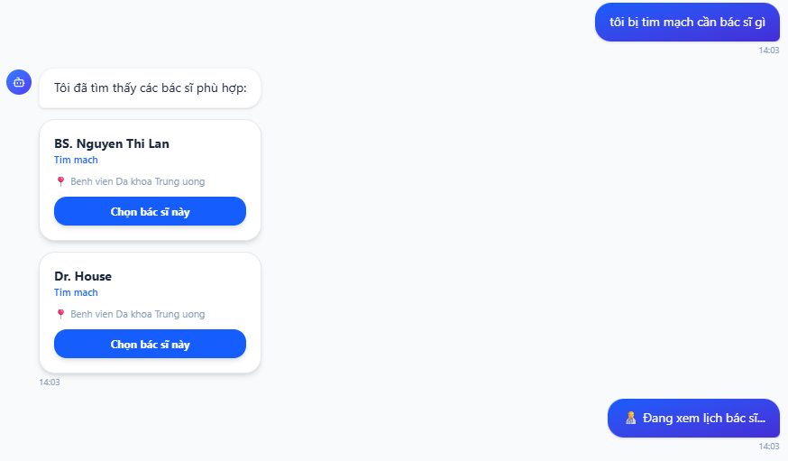
> 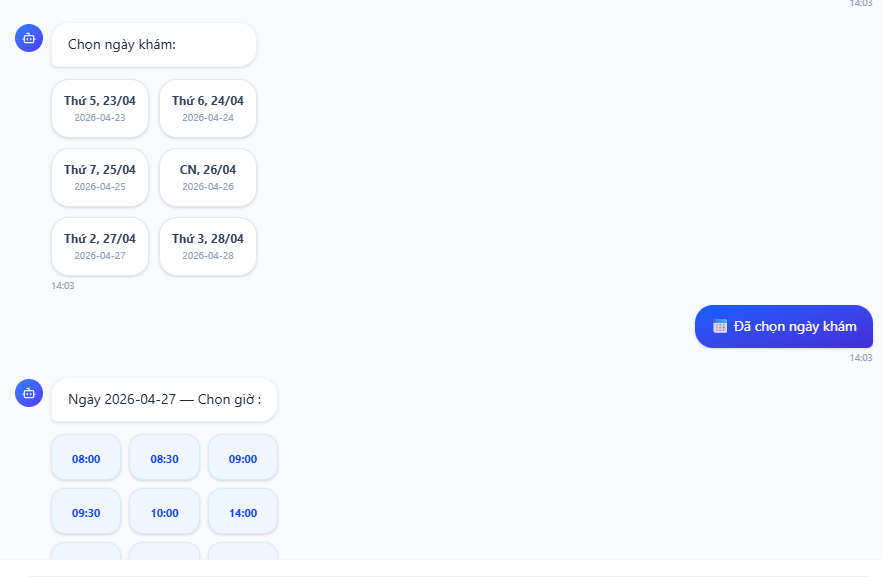
> 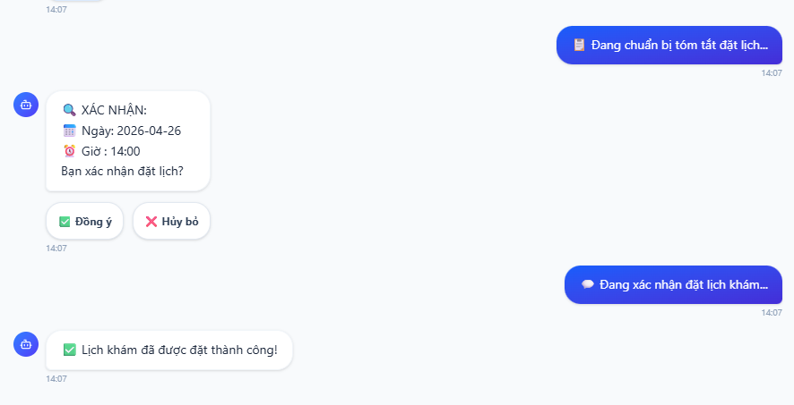
> 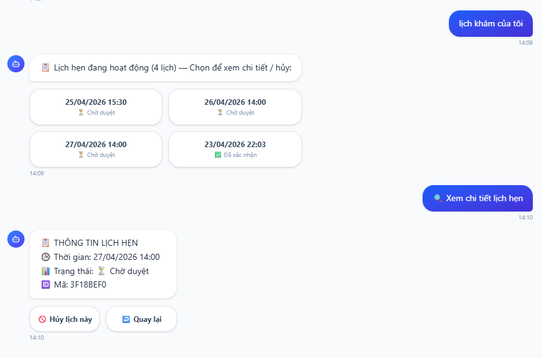
> 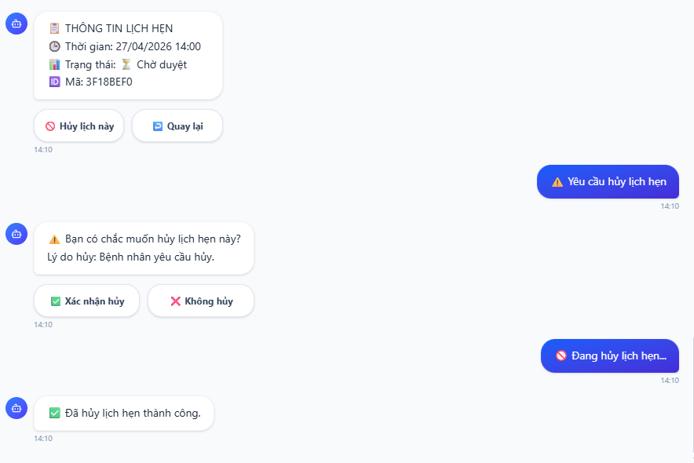

---
*Kết thúc lưu trình test Report hệ thống.*
